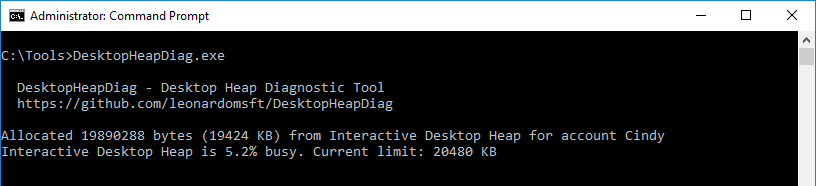
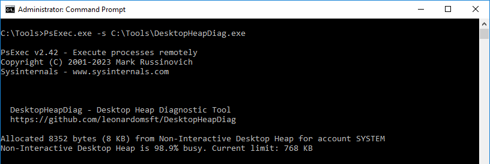
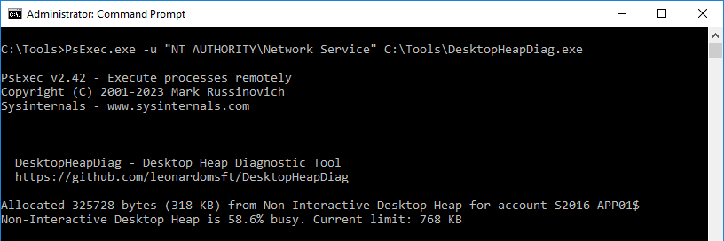

# DesktopHeapDiag - Desktop Heap Diagnostic Tool

Command-line utility to help diagnose Desktop Heap Exhaustion issues.
DesktopHeapDiag can probe the Desktop Heap and display the current usage %.


# Switches
```
Usage: DesktopHeapDiag.exe [SWITCHES]
      -amount    (optional) : amount of memory (in KB) to allocate from the Desktop Heap, rounded to the nearest multiple
      -wait      (optional) : Delay (in seconds) to wait before releasing the memory
      -? -help   (optional) : Prints this Help
```

# Examples

DesktopHeapDiag.exe
	Displays the desktop heap usage % for current interactive session




PsExec.exe -s DesktopHeapDiag.exe
	Display the desktop heap usage % for non-interactive session System (using PsExec from Sysinternals).



PsExec.exe -u "NT AUTHORITY\Network Service" DesktopHeapDiag.exe
	Display the desktop heap usage % for the non-interactive session Network Service (using PsExec from Sysinternals).




# Download

https://github.com/leonardomsft/DesktopHeapDiag/releases/download/v1/DesktopHeapDiag.exe


## Resources

You may receive an error "Out of Memory" because of the desktop heap limitation

	https://learn.microsoft.com/en-us/troubleshoot/windows-server/performance/desktop-heap-limitation-out-of-memory


