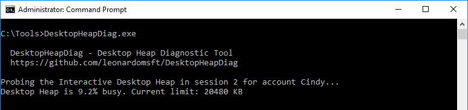
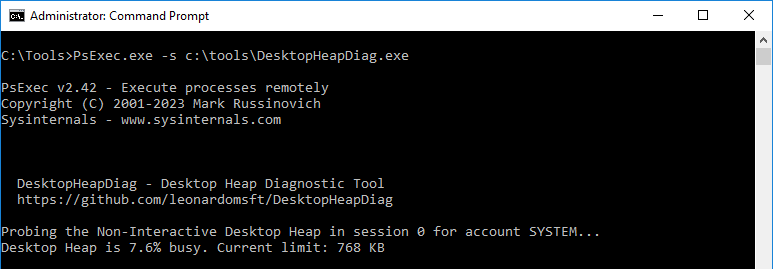
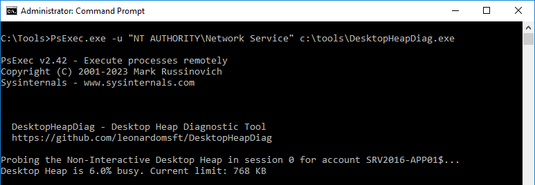

# DesktopHeapDiag - Desktop Heap Diagnostic Tool

Command-line utility to help diagnose Desktop Heap Exhaustion issues.
DesktopHeapDiag can probe the various Desktop Heaps and display their current usage %.


# Switches
```
Usage: DesktopHeapDiag.exe [SWITCHES]
      -amount    (optional) : amount of memory (in KB) to allocate from the Desktop Heap, rounded to the nearest multiple
      -wait      (optional) : Delay (in seconds) to wait before releasing the memory
      -? -help   (optional) : Prints this Help
```

# Examples

DesktopHeapDiag.exe

Displays the desktop heap usage % for current interactive session




PsExec.exe -s C:\Tools\DesktopHeapDiag.exe
	
Displays the desktop heap usage % for non-interactive session "System" (using PsExec from Sysinternals).



PsExec.exe -u "NT AUTHORITY\Network Service" C:\Tools\DesktopHeapDiag.exe

Displays the desktop heap usage % for the non-interactive session "Network Service" (using PsExec from Sysinternals).




# Download

https://github.com/leonardomsft/DesktopHeapDiag/releases/download/v1/DesktopHeapDiag.exe


# More on Desktop Heaps

## What's a Desktop Heap?
A desktop is a logical display surface that contains user interface objects. 
It represents the windowing message boundary for all processes that are on the same desktop.
Desktop heap is a shared block of memory in which all user interface objects are allocated for a given desktop.

## What's a Window Station?
A window station is a securable object that contains a clipboard, an atom table, and one or more desktops.
When a window station is created, it is associated with the calling process and assigned to the current session.

Window Stations can be interactive or non-interactive:

Interactive window station is the only window station that can display a user interface or receive user input. It's always named "WinSta0".

Non-interactive windows stations lack membership in "NT AUTHORITY\INTERACTIVE" group, therefore cannot interact with the desktop.

## What's a Session?
Sessions contains Window Stations, Window Stations contains Desktops, Desktops contains User Interface Objects

## How processes consume desktop heap?
Most Win32 processes require a desktop object under which to run. 
When an application requires a user interface object, functions within user32.dll are called to allocate those objects.
User interface objects include Windows, Menus, Icons, Cursors, Hooks, Brushes, etc.

Example of how an application can use desktop heap:
  1. An application needs to create a window, so it calls CreateWindowEx in user32.dll.
  2. User32.dll makes a system call into kernel mode and ends up in win32k.sys.
  3. Win32k.sys allocates the window object from desktop heap
  4. A handle to the window (an HWND) is returned to caller
  5. The application and other processes in the same window station can refer to the window object by its HWND value

## What is Desktop Heap Exhaustion?
If a process creates too many user objects and never destroys them (memory leak), the desktop heap can become exhausted over time.
When the offending process runs as a service, a non-interactive desktop heap may become exhausted.

The following symptoms can occur:
1. Processes may fail to start with STATUS_DLL_INIT_FAILED (0xC0000142) error in user32.dll, exit code -1073741502.
2. Processes may fail to create new windows
3. Right-clicking does not bring the menu
4. Event 243 is logged in the System event log: Warning 243 Win32k A desktop heap allocation failed. 

## Troubleshooting
Desktop heap usage is not currently tracked in the system, so it's not available through any performance counter or API.
DesktopHeapDiag.exe can assess the usage of various desktop heaps by momentarily probing them with small allocations, until the limit is reached.
Interactive desktop heaps can be assessed by directly running DesktopHeapDiag.exe. Non-interactive desktop heaps can be assessed with the help of PsExec from Sysinternals. Anything over 60% should be investigated. Restarting processes/services release all user objects, so it can be used to pinpoint the culprit. The number of User/GDI handles can also provide a clue.


## Limits

The limits for Interactive and Non-Interactive desktop heaps are defined by the SharedSection value in the registry:

HKEY_LOCAL_MACHINE\System\CurrentControlSet\Control\Session Manager\SubSystems\Windows = SharedSection=1024,20480,768

(1024) is the session view space, not associated with desktop heap.

(20480) is the size of the "Default" desktop heap for the interactive window station

(768) is the size of the "Default" desktop heap for each "non-interactive" window station.


# Resources

Desktop Heap Overview

https://learn.microsoft.com/en-us/archive/blogs/ntdebugging/desktop-heap-overview

Troubleshooting CreateWindowEx failures

https://blogs.msdn.microsoft.com/dsui_team/2012/11/05/troubleshooting-createwindowex-failures/

Window Stations

https://learn.microsoft.com/en-us/windows/win32/winstation/window-stations

User Objects

https://docs.microsoft.com/en-us/windows/desktop/sysinfo/user-objects


